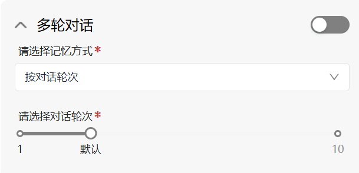
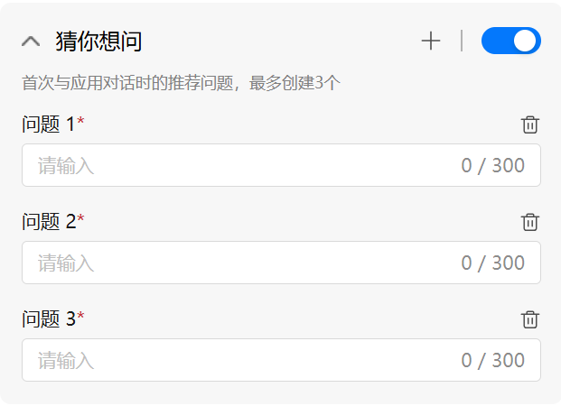
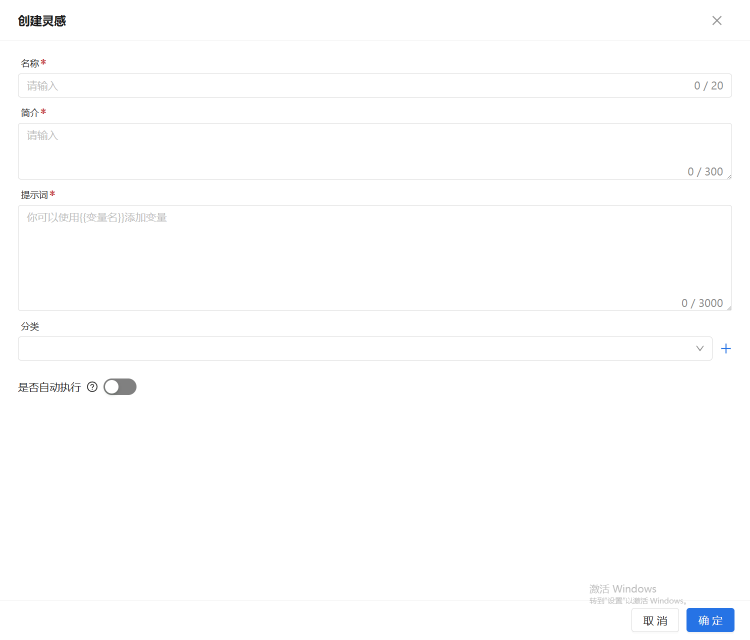

# 基础编排对话助手详细介绍

支持以下界面能力：

- **配置大模型**：
  - 可通过下拉菜单选择不同的大模型。
  - 支持设置"温度"参数，用于控制模型输出的随机性：
    - 温度越高，模型输出越多样化，创造性越强；
    - 温度越低，输出更保守稳定，适合严谨场景。
  - 用户可以输入提示词，并调用 AI 功能对提示词进行优化，提升应用回答质量。

- **配置知识库**：
  - 可为应用配置专属知识库，使大模型具备知识检索能力。
  - 添加知识库后，应用即可结合模型能力与知识内容，回答更精准、专业的问题。

- **开场白**：可设置在用户与应用开始对话前展示的一段欢迎语，用于营造对话氛围或引导用户提问。

- **多轮对话**：
  - 可配置是否启用对话记忆，让大模型能记住前文内容。
  - 支持设定最大对话轮次（范围 0~10），控制用户与模型连续交互的对话长度。

- **猜你想问**：
  - 可预置最多 3 条推荐问题，展示在用户首次打开应用时。
  - 这些问题会显示在对话框上方，用户点击后即可向模型提问，提升引导性和易用性。

- **创意灵感**：
  - 支持提前配置常用问题，并按一级分类管理。
  - 在对话界面中以"灯泡"按钮形式展示，用户点击后可快速使用这些问题，激发更多互动。

