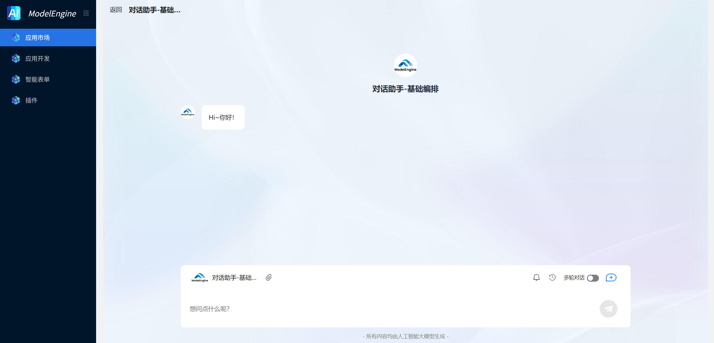
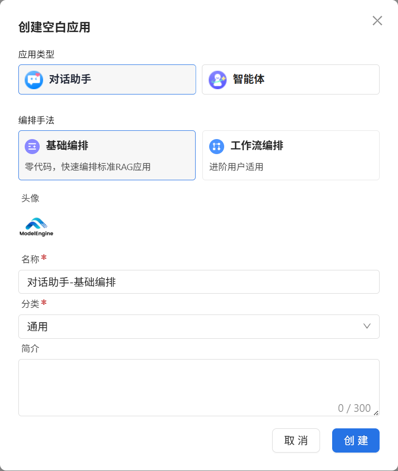
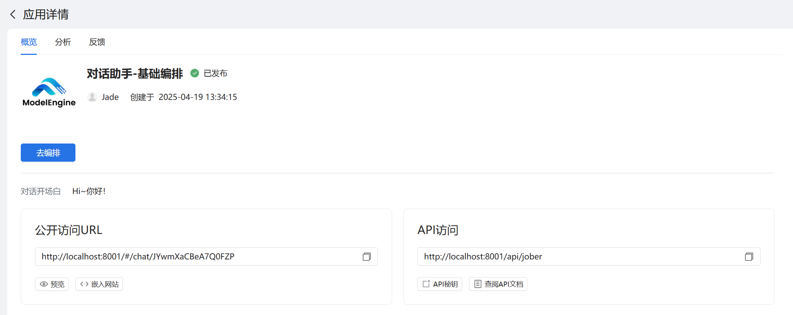

# 搭建一个 AI 基础编排对话助手

就算你没有编程基础，也能在 ModelEngine 上快速创建一个对话式 AI 助手。我们这次以"对话助手-基础编排"为例，通过直接输入参数就能编排的模式，快速编排一个具备逻辑处理和交互能力的对话助手。

## 对话助手效果预览

## 搭建步骤

### 步骤一：创建一个基础编排对话助手

1. 登录 ModelEngine 平台。
2. 在左侧菜单栏，单击**应用开发**。
3. 在**应用开发**页面，单击**创建空白应用**。
4. 应用类型选择**对话助手**，编排手法选择**基础编排**。
5. 上传应用头像，输入应用名称，选择应用分类，填写简介后单击**创建**。

### 步骤二：编写基础聊天设置

1. 点击**大模型**调用预设的大语言模型，实现问答等能力。

| 配置项 | 说明                                 |
|-----|------------------------------------|
| 模型  | 选择使用的模型，例如 Qwen/Qwen2.5-72B-Chat |
| 温度  | 控制生成结果的随机性，值越小越稳定，默认 0.3        |
| 提示词 | 填写大模型输入的提示词                        |

2. 点击**知识库**添加知识库，实现基于向量或关键词的知识内容检索。
3. 点击**开场白**可设置在用户与应用开始对话前展示的一段欢迎语，用于营造对话氛围或引导用户提问。
   例如："你好，我是一个对话助手，请输入内容开始对话。"
4. 点击**多轮对话**可配置是否启用对话记忆，让大模型能记住前文内容。
5. 点击**猜你想问**可预置最多 3 条推荐问题，展示在用户首次打开应用时。
6. 点击**创意灵感**可支持提前配置常用问题，并按一级分类管理。

### 步骤三：发布对话助手

1. 测试完成后，点击右上角的**发布**按钮，填写发布信息。
2. 该对话助手将出现在首页的**应用市场**中，用户可以直接点击应用卡片，与发布的应用发起对话。
3. 发布后，系统会自动生成公开访问和北向接口链接，并可将其分享到外部平台，或嵌入其他业务系统中，可在首页的**应用开发**页面点击应用卡片，在**应用概览**中查询。

