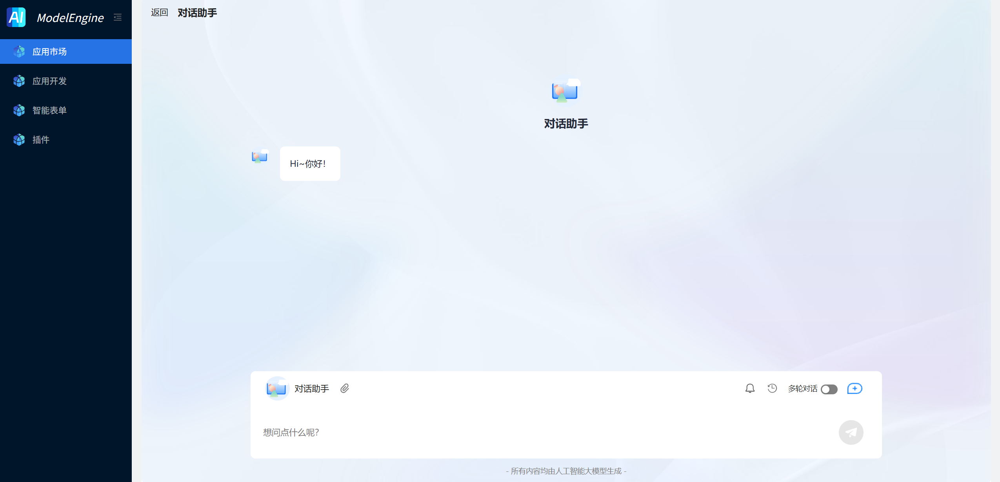
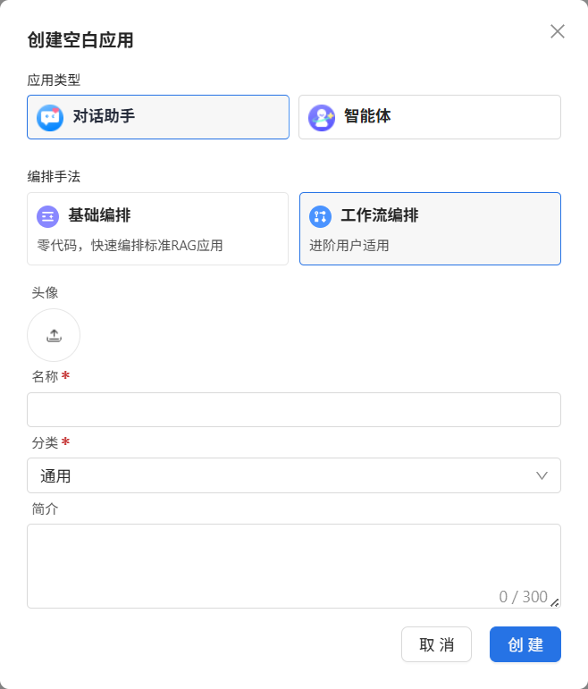
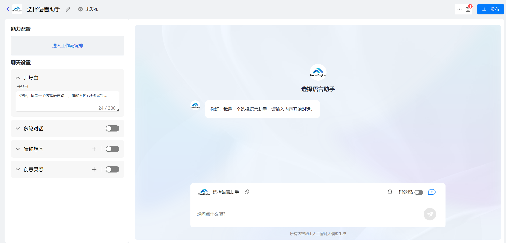
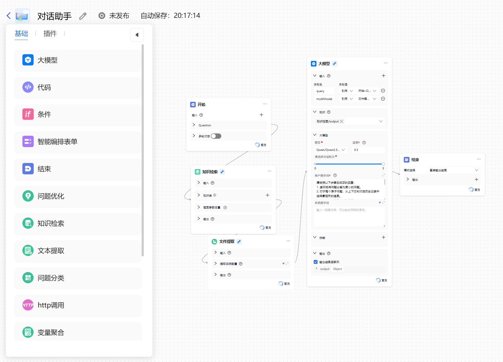
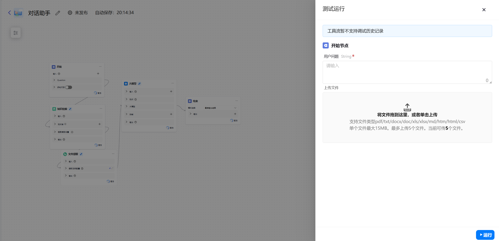
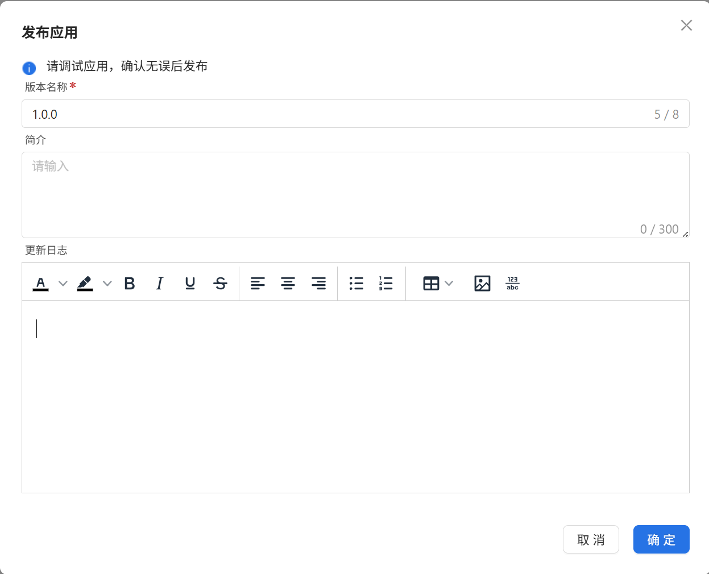
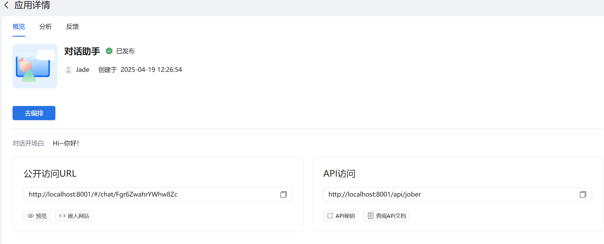

# 搭建一个 AI 工作流对话助手


就算你没有编程基础，也能在 ModelEngine 上快速创建一个支持流程控制的对话式 AI 助手。我们这次以"对话助手"为例，通过知识检索节点、文件提取节点和大模型节点，快速编排一个具备逻辑处理和交互能力的对话助手。

## 对话助手效果预览



## 搭建步骤

### 步骤一：创建一个工作流对话助手

1. 登录 ModelEngine 平台。
2. 在左侧菜单栏，单击**应用开发**。
3. 在**应用开发**页面，单击**创建空白应用**。
4. 应用类型选择**对话助手**，编排手法选择**工作流编排**。
5. 上传应用头像，输入应用名称，选择应用分类，填写简介后单击**创建**。



### 步骤二：编写基础聊天设置

1. 点击**开场白**可设置在用户与应用开始对话前展示的一段欢迎语，用于营造对话氛围或引导用户提问。
   例如："你好，我是一个对话助手，请输入内容开始对话。"

2. 点击**多轮对话**可配置是否启用对话记忆，让大模型能记住前文内容。
3. 点击**猜你想问**可预置最多 3 条推荐问题，展示在用户首次打开应用时。
4. 点击**创意灵感**可支持提前配置常用问题，并按一级分类管理。



### 步骤三：进入工作流编排配置对话助手

平台提供丰富的工作流节点类型，用户可根据需求自由组合，构建出符合业务逻辑的 AI 应用。当前支持的基础节点包括：

- **大模型**：调用预设的大语言模型，实现文本生成、问答等能力。
- **代码**：编写并运行 Python 代码，实现自定义逻辑或数据处理。
- **条件**：设置流程判断条件，支持基于变量值进行分支逻辑跳转。
- **智能编排表单**：用于收集用户输入的结构化信息，可用于后续节点处理。
- **结束**：表示流程终止点，执行到该节点后结束本轮工作流。
- **知识检索**：对接知识库，实现基于向量或关键词的知识内容检索。
- **HTTP 调用**：支持调用第三方或自有系统的 HTTP 接口，扩展外部能力。
- **变量聚合**：用于合并多个变量的值，适用于复杂的数据整理或生成响应。
- **文件提取**：支持对上传或传入的文件内容进行抽取处理，例如文本读取等。
- **注释**：用于对流程节点添加说明文字，提升可读性与协作效率。
- **循环**：实现流程的循环控制，支持遍历数组或指定次数的重复执行。
- **人工表单**：用于中断流程并等待人工输入，适合审核类或人机协作场景。

#### 示例：调用一个大模型节点：多模态问题细化与信息抽取

该节点用于调用大模型（如 Qwen/Qwen2.5-72B-Chat）对用户输入的问题进行细化分析，并结合知识库输出更有针对性的回复，支持多轮上下文与多模态输入。

##### 输入配置

| 字段名       | 来源说明           |
|--------------|--------------------|
| query     | 引用开始节点中的用户提问内容 |
| multiModalInput | 引用文件提取节点的返回结果 |

以上字段将作为大模型 prompt 的一部分，参与生成。

##### 知识配置

| 字段名       | 来源说明           |
|--------------|:-------------------|
| 知识引用      | 知识检索/ output |

来自上游知识检索节点的结果作为补充知识输入，协助大模型更准确生成答案。

##### 模型参数设置

| 配置项 | 说明                                 |
|-----|------------------------------------|
| 模型  | 选择使用的模型，例如 Qwen/Qwen2.5-72B-Chat |
| 温度  | 控制生成结果的随机性，值越小越稳定，默认 0.3         |
| 提示词 | 填写大模型输入的提示词                        |
| 对话轮次 | 最多引用的对话上下文轮次，默认 3               |

##### 用户提示词

```text
请按照以下步骤生成您的回复：
1. 递归地将问题分解为更小的问题。
2. 对于每个原子问题，从上下文和对话历史记录中选择最相关的信息。
3. 使用所选信息生成回复草稿。
4. 删除回复草稿中的重复内容。
5. 在调整后生成最终答案，以提高准确性和相关性。
6. 请注意，只需要回复最终答案。
-------------------------------------
提取文件信息：

{{multiModalInput}}

问题：{{query}}
```

##### 工具设置

如需启用大模型调用外部插件能力，可在大模型节点中选中技能区域，配置相关插件。

| 配置项   | 说明 |
|----------|------|
| 工具 | 在节点中选择可用插件（如天气查询、翻译、图像识别等） |
| 插件可见性 | 插件应已在首页的插件页面内注册，才能被模型调用 |
| 模型能力要求 | 所选大模型需具备 Tool Call 能力 |
| 提示词要求 | 在用户提示词中应显式加入"调用工具"、"使用插件"、"如果需要，请调用……"等引导性语言，以启用工具自动调用逻辑 |

##### 模型返回参数

模型节点最终会输出一个结构化的对象，包含大模型生成的回复内容和引用信息。



### 第四步：调试对话助手

完成流程编排后，可以使用右侧的调试区域与智能体进行对话测试。



### 第五步：发布对话助手

1. 测试完成后，点击右上角的**发布**按钮，填写发布信息。
2. 该对话助手将出现在首页的**应用市场**中，用户可以直接点击应用卡片，与发布的应用发起对话。
3. 发布后，系统会自动生成公开访问和北向接口链接，并可将其分享到外部平台，或嵌入其他业务系统中，可在首页的**应用开发**页面点击应用卡片，在**应用概览**中查询。





## 小贴士

- 多尝试、多调试，你的智能体会变得越来越聪明！
