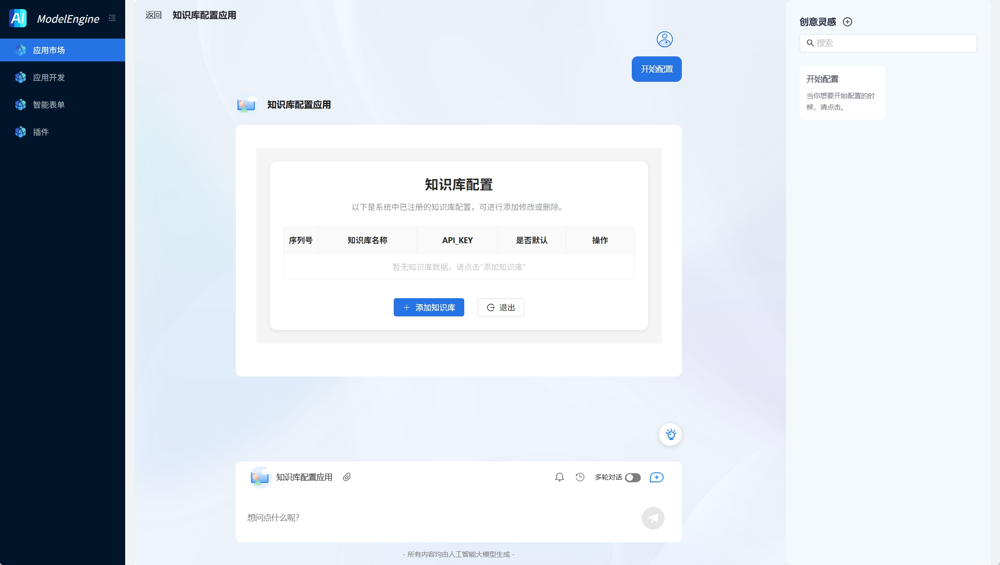
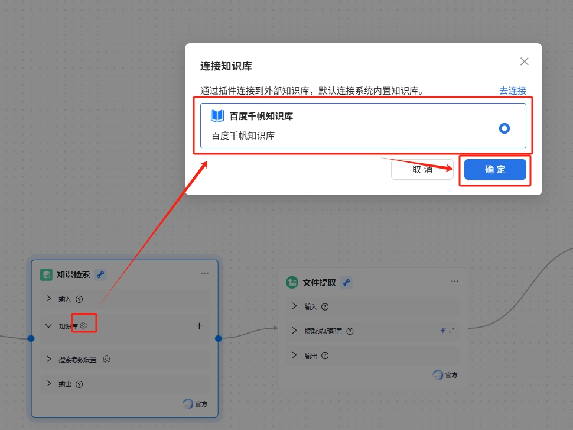
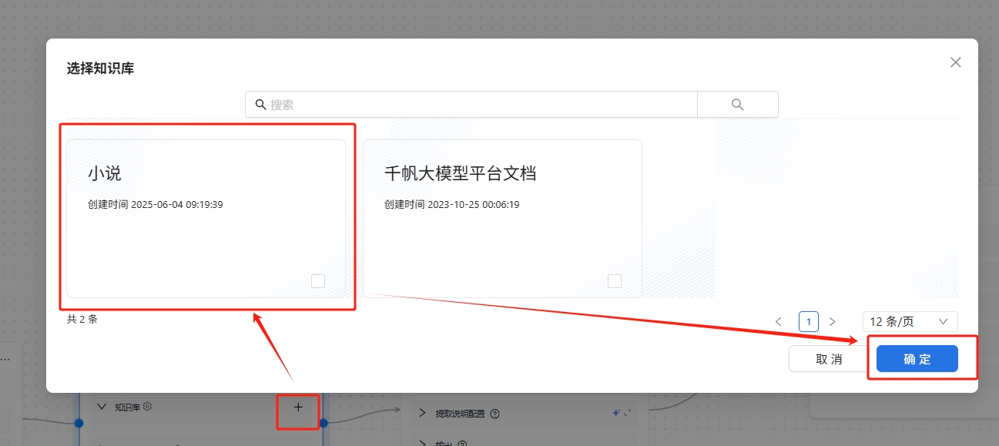

# 自定义知识库

**——轻松接入百度千帆 · 自定义知识管理 · 一站式API集成**

为企业和开发者提供 **零代码接入百度千帆知识库** 的能力，通过简单的 **API Key 配置**，快速构建专属知识库应用，实现智能问答、文档检索、数据增强等场景需求。

作为中立的 LLM 应用开发平台，ModelEngine致力于给予开发者更多选择权。

**连接外部自定义知识库**功能可以将 ModelEngine平台与外部知识库建立连接。通过 API 服务，AI 应用能够获取更多信息来源。这意味着：

- ModelEngine平台能够直接获取托管在云服务提供商知识库内的文本内容，开发者无需将内容重复搬运至 ModelEngine中的知识库；
- ModelEngine平台能够直接获取自建知识库内经算法处理后的文本内容，开发者仅需关注自建知识库的信息检索机制，并不断优化与提升信息召回的准确度。

### 创建百度千帆知识库

点击[创建百度千帆知识库](https://console.bce.baidu.com/ai_apaas/personalSpace/knowledgeBase/create)，待知识库创建完成后，获取知识库的API Key值。

### 知识库配置

选择已经配置的 **百度千帆API Key**，一键完成知识库授权与绑定

自动同步知识库内容，提供可视化文档管理界面。支持自定义知识库后，可以在`知识检索`节点中选择配置千帆知识库中自定义知识库。

1. 点击**知识库**旁边的配置按钮选择配置知识库

2. 选择自定义知识库

---

**立即体验**：只需一个API Key，开启您的智能知识管理之旅！