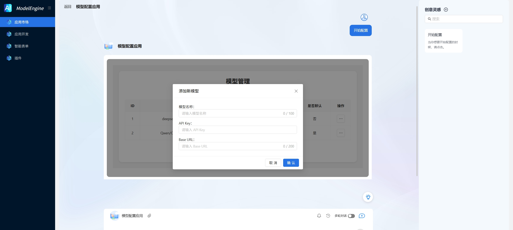

# 自定义模型

**——灵活接入 · 一键部署 · 全流程管理**

为开发者和企业提供 **标准化API接口管理能力**，通过简单的 `API Key + Base URL` 配置，快速接入并自定义第三方/私有化模型，实现 **零基础架构维护** 的AI能力集成。

---

在应用市场中打开`模型配置应用`，即可配置模型，如图所示

支持用户填写任意模型的 **Base URL** 和 **API Key**，秒级完成主流AI服务（如OpenAI、Gemini、Claude或私有化部署模型）的接入。

自动验证接口连通性，生成标准化调用模板，支持在其他流程编排中`大模型节点`选择自定义模型并使用。

---

**立即体验**：只需30秒，将您的第一个模型API变为可调用的智能服务！
