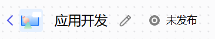
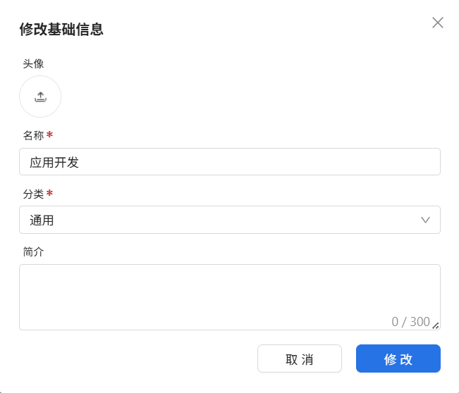
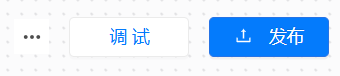
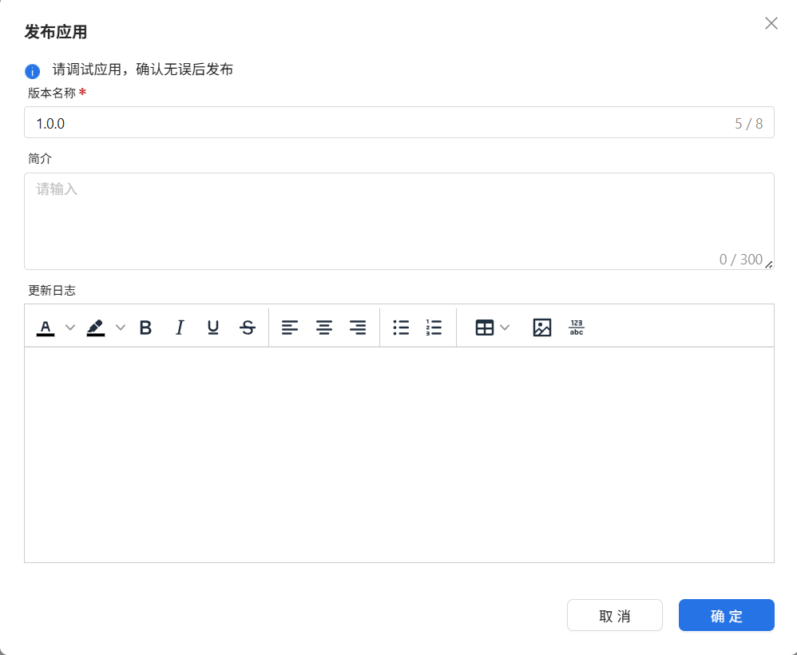

# 应用设置

## 一、应用信息

在应用信息设置区域，你可以直观地查看和修改当前智能应用的基本信息，包括应用的头像、名称以及应用的发布状态。

用户可以点击应用名称右侧的铅笔图标来修改应用信息，包括头像、名称、分类和简介等。

- **未发布状态**下，所有信息均可自由编辑；
- **已发布状态**下，应用名称将锁定不可修改，以保障线上环境的稳定性，但头像、分类和简介仍可调整。

应用的发布状态也会以直观图标形式展示在界面中，便于用户快速识别当前状态：

- **已发布**：显示已发布标识
- **未发布**：显示未发布标识

通过这些提示标识，用户可以清晰判断当前应用的发布状态，并决定后续是否进行编辑或发布操作。

## 二、调试发布

调试发布区域提供了当前应用的测试运行和正式发布功能，帮助用户快速验证与上线应用。

如上图所示，区域右上角提供三个按钮：

- **更多操作**：点击此按钮，你可以导出当前的应用文件，方便进行备份、迁移或分享应用配置。

- **调试按钮**：点击后将开启调试模式，通过选择"运行"，你可以实时测试和验证当前工作流的执行逻辑，确保各个环节符合预期要求。

- **发布按钮**：当工作流逻辑调试确认无误后，点击发布按钮即可正式发布应用。发布前，你需要填写版本名称、版本简介以及更新日志，以清晰记录应用更新的历史信息。填写完成后点击确认，应用即正式上线。

通过应用设置区域，用户能便捷地管理应用信息，并高效完成应用的调试与发布流程。
