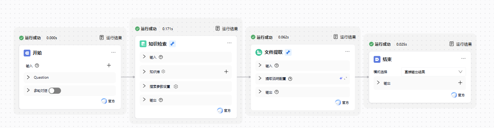

# 画布功能

画布区域是工作流的主要编排空间，用户可以在此以图形化方式拖拽、连接和配置各类节点，完成整个流程逻辑的设计。为提升流程编排的效率与灵活性，画布提供了多种实用的操作功能，帮助用户便捷地查看、调整和管理工作流结构。

## 操作模式切换

画布右下角提供了两种操作模式：**鼠标模式**与**手型模式**。

- 默认状态为**手型模式**，鼠标拖拽将整体移动画布，适合在流程较长或节点较多时快速浏览与定位流程结构。
- 当切换为**鼠标模式**（通过点击手形图标）后，用户可以直接点击选中任意节点，进行参数配置、连线编辑或节点删除等操作。

## 节点整理功能

紧挨着手型图标右侧的是 **节点整理功能** 按钮。点击后，系统将根据流程执行顺序自动对节点进行排布整理，使流程结构更规整、更清晰，方便用户快速理解和查看整体逻辑走向，尤其在流程较复杂时尤为实用。

## 页面自适应与缩放

在画布的右下方，还有一个**页面自适应功能**按钮。点击该按钮后，画布将自动缩放并居中显示全部节点内容，确保所有流程节点都完整出现在视野范围内，便于用户对流程进行全局把控与复查。

此外，在画布右下角还提供了缩放工具，用户可以根据需要手动放大或缩小画布视图，精准地查看细节或整理整体结构。

通过以上功能，工作流画布不仅实现了智能逻辑的可视化，还提供了高效、灵活、易操作的编辑体验，帮助用户在构建复杂流程时依然能够保持清晰的结构与良好的控制感。
