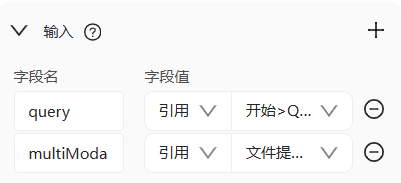
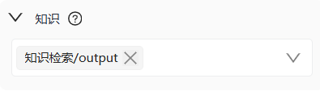
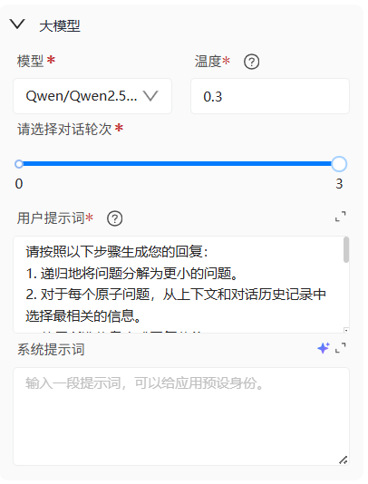
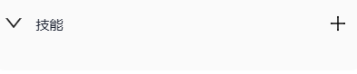
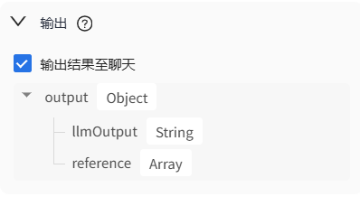

# 大模型节点

## 节点说明

大模型节点用于在AI工作流中调用大语言模型，执行问答、知识引用、插件调用等高级任务，支持上下文感知和知识溯源。

## 配置大模型

配置大模型包括以下五个模块：输入、知识、大模型、技能和输出。

### 1. 输入模块

输入模块用于配置当前节点所需的入参，这些参数可以引用前置节点的输出结果并被提示词模板调用。

默认模板中包含以下两个字段：

| 字段名             | 字段值              | 说明            |
| --------------- | ---------------- | ------------- |
| query           | 引用：开始 > query    | 用户的问题         |
| multiModalInput | 引用：文件提取 > output | 前置文件提取节点的输出内容 |



### 2. 知识模块

知识模块用于引用前置节点检索到的知识信息，作为大模型运行时的上下文信息。

* 启用此模块后，系统会自动提供溯源信息。
* 本案例中引用了"知识检索"节点的输出。



### 3. 大模型模块

| 配置项 | 说明                               |
| --- | -------------------------------- |
| 模型  | 选择使用的模型，例如 Qwen/Qwen2.5-72B-Chat |
| 温度  | 控制生成结果的随机性，值越小越稳定，默认 0.3         |
| 提示词 | 大模型生成结果所依据的输入提示词                 |

#### 系统提示词与用户提示词的区别

* **系统提示词**：指导模型如何整体理解任务和设定整体对话风格，相当于对模型整体任务和行为的背景设定。
* **用户提示词**：明确给出模型具体需要完成的具体任务或问题，相当于实际执行的具体指令。

**自动生成系统提示词**：点击系统提示词输入框右侧的自动生成图标，系统会根据上下文自动生成适合当前任务的系统提示词。



### 4. 技能模块

技能模块可用于配置大模型的插件与工具流能力，需确保所选模型支持 ToolCall 功能。



### 5. 输出模块

输出模块用于配置当前节点的输出行为，具体包括以下两部分：

#### （1）输出结果至聊天

* 勾选后，大模型的运行结果将直接在聊天界面中呈现。

#### （2）输出格式

大模型节点的输出格式如下：

```json
output: {
  llmOutput: String, // 大模型输出的文本结果
  reference: Array   // 包含引用的知识源等信息
}
```

* `llmOutput`：模型生成的文本内容。
* `reference`：溯源信息，指示使用了哪些知识作为上下文。



## 常见问题

1. **模型温度如何设置更合适？**

  * 温度越低输出越稳定，适用于任务明确的场景；温度越高生成内容越多样化，适用于创意型任务。

2. **为什么我的节点没有溯源信息？**

  * 确认知识模块已启用，并正确引用前置知识检索节点的输出。

3. **如何使用插件功能？**

  * 首先确认所选模型支持ToolCall功能，然后在技能模块中配置相应插件或工具流。
